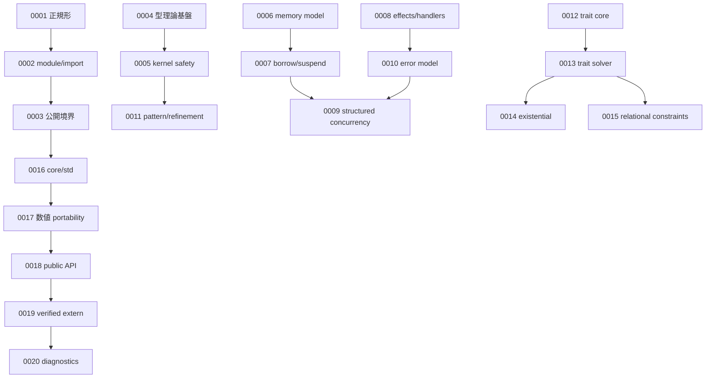
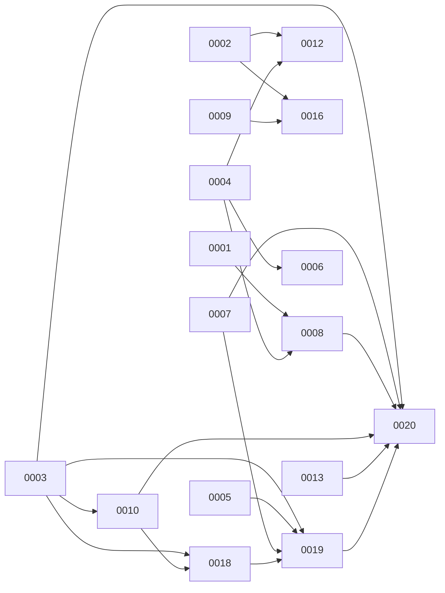

# RFC Map

矢印は、**先に読むと理解しやすい依存関係** と **参照してから読むべき関係** を表します。

## 読順の骨格

## 相互参照の強いリンク

## すぐ飛びたいときのリンク

- [RFC Index](./RFC_INDEX.md)
- [0001](./0001-canonical-surface-and-declarative-defaults.md)
- [0003](./0003-visibility-and-boundary-modules.md)
- [0016](./0016-core-std-and-runtime-profile.md)
- [0019](./0019-verified-extern-evidence-model.md)
- [0020](./0020-diagnostics-contract.md)
