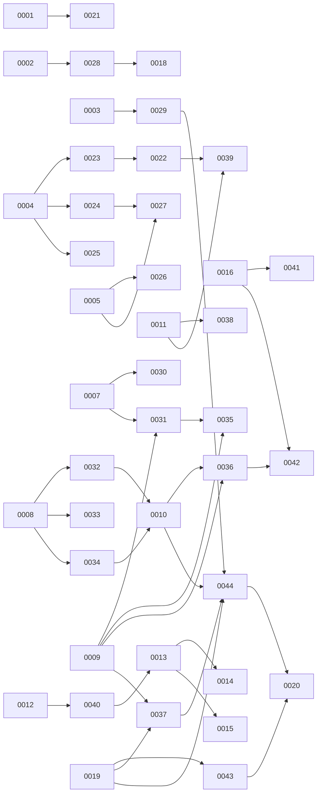

# RFC Map

矢印は、**主要な読順依存** と **代表的な詳細 owner 参照** を表します。全 lineage の完全列挙は `rfc_restructuring_state.json` を正本とします。

## 読順の骨格

```mermaid
flowchart TD
  subgraph SurfaceBoundary[Surface / Boundary]
    R0001[0001 正規形]
    R0021[0021 評価順]
    R0002[0002 module/import]
    R0003[0003 可視性総論]
    R0028[0028 export closure]
    R0029[0029 boundary module]
    R0016[0016 core/std 総論]
    R0041[0041 core/std 境界]
    R0042[0042 runtime profile]
    R0017[0017 数値 portability]
    R0018[0018 public API]
  end

  subgraph TypeCore[Type Core]
    R0004[0004 型理論総論]
    R0023[0023 QTT / universe]
    R0024[0024 proof erasure]
    R0025[0025 divergence]
    R0005[0005 kernel safety 総論]
    R0026[0026 inductive/codata]
    R0027[0027 kernel conversion]
    R0022[0022 bidirectional typing]
    R0011[0011 pattern 総論]
    R0038[0038 coverage]
    R0039[0039 refinement]
  end

  subgraph MemoryEffectsAsync[Memory / Effects / Async]
    R0006[0006 memory model]
    R0007[0007 borrow 総論]
    R0030[0030 borrow core]
    R0031[0031 suspend boundary]
    R0008[0008 effects 総論]
    R0032[0032 effect rows]
    R0033[0033 handlers]
    R0034[0034 effect abstraction]
    R0010[0010 error model]
    R0009[0009 async 総論]
    R0035[0035 structured concurrency]
    R0036[0036 cancellation/deadline]
    R0037[0037 Send/Share]
  end

  subgraph TraitsBoundary[Traits / Verified Extern / Diagnostics]
    R0012[0012 trait core]
    R0040[0040 associated items]
    R0013[0013 trait solver]
    R0014[0014 existential]
    R0015[0015 relational constraints]
    R0019[0019 verified extern 総論]
    R0043[0043 checker interface]
    R0044[0044 wrapper obligations]
    R0020[0020 diagnostics]
  end

  R0001 --> R0021 --> R0002 --> R0003 --> R0028 --> R0029 --> R0016 --> R0041 --> R0042 --> R0017 --> R0018
  R0018 --> R0004 --> R0023 --> R0024 --> R0025 --> R0005 --> R0026 --> R0027 --> R0022 --> R0011 --> R0038 --> R0039
  R0039 --> R0006 --> R0007 --> R0030 --> R0031 --> R0008 --> R0032 --> R0033 --> R0034 --> R0010 --> R0009 --> R0035 --> R0036 --> R0037
  R0037 --> R0012 --> R0040 --> R0013 --> R0014
  R0013 --> R0015
  R0015 --> R0019 --> R0043 --> R0044 --> R0020
```

## 相互参照の強いリンク

## すぐ飛びたいときのリンク

- [RFC Index](./RFC_INDEX.md)
- [0001](./0001-canonical-surface-and-declarative-defaults.md)
- [0021](./0021-evaluation-strategy-and-order-of-evaluation.md)
- [0023](./0023-type-theory-core-and-universes.md)
- [0030](./0030-borrow-core-place-model-and-reborrow.md)
- [0032](./0032-effect-rows-and-builtin-effects.md)
- [0035](./0035-structured-concurrency-core.md)
- [0043](./0043-verified-extern-checker-interface.md)
- [0044](./0044-verified-extern-wrapper-obligations-and-logical-safe.md)
- [0020](./0020-diagnostics-contract.md)
